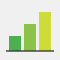
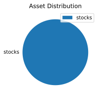
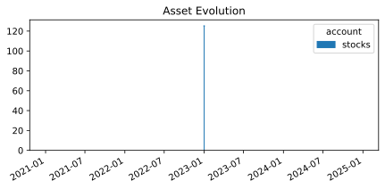
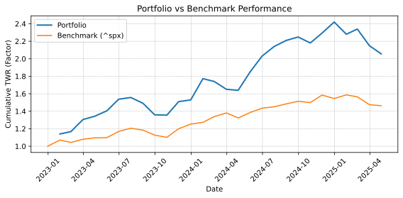
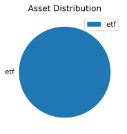
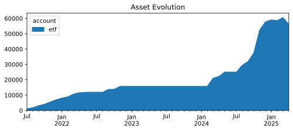
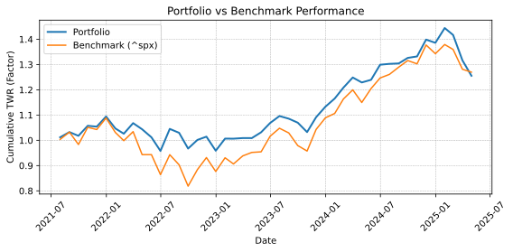

#+begin_center

#+end_center

Simple collection python modules to enhance =ledger= applications for portfolio management.
While tools like =ledger= and =hledger= are excellent for tracking overall investment accounts, they often lack specific conveniences for detailed capital gains calculations and reporting, especially when dealing with multiple lots and cost basis methods.
This project aims to fill some of those gaps.

* Features

1. Fetch historical market prices for commodities/stocks using Yahoo Finance.
2. Adjust prices for stock splits.
3. Generate ledger price database entries (P directives).
4. Calculate cost basis for transactions using average cost method (via `costbasis` module).
5. Generate portfolio performance reports (requires `hledger`).

* Installing

Create a virtual environment, if it already does not exist[fn:1].

#+begin_src sh
python3.12 -m venv ~/.venvs/general
#+end_src

#+RESULTS:

Then using pip from the virtual environment on the source code root directory.
The flag =-e= is for "editable" so one can edit the source code.

#+begin_src sh :results silent :async yes :session install
cd ~/.local/src/investory/
~/.venvs/general/bin/pip install -e . 
#+end_src

[fn:1] https://packaging.python.org/en/latest/tutorials/installing-packages/#creating-virtual-environments 

* How to use it
:PROPERTIES:
:header-args: :exports both
:header-args:sh+: :prologue source ~/.venvs/general/bin/activate
:header-args:python+: :python /home/nasser/.venvs/general/bin/python
:END:
** Values module
*** Basic functionality

Get commodity (given as yahoo ticker) price for each month.
The price is saved in a ledger file named ~ticker.ledger~.

#+begin_src sh :dir examples/values :results output
python -m investory.values --commodity AAPL --begin 2023-01-01 --verbose 1
head AAPL.ledger
rm AAPL.ledger
#+end_src

#+RESULTS: 
#+begin_example
Processing commodity: AAPL
Yahoo Ticker: AAPL
Currency: $
Output directory: /home/nasser/.local/src/investory/examples/values
Ledger file path: /home/nasser/.local/src/investory/examples/values/AAPL.ledger
File /home/nasser/.local/src/investory/examples/values/AAPL.ledger not found when trying to get last date.
File /home/nasser/.local/src/investory/examples/values/AAPL.ledger not found, using default initial date: 2023-01-01
Fetched 580 historical data points for AAPL.
Writing 27 new month-end entries to /home/nasser/.local/src/investory/examples/values/AAPL.ledger...
Finished processing AAPL.
P 2023-01-31 "AAPL" $142.631607
P 2023-02-28 "AAPL" $145.938263
P 2023-03-31 "AAPL" $163.253616
P 2023-04-28 "AAPL" $167.985901
P 2023-05-31 "AAPL" $175.723053
P 2023-06-30 "AAPL" $192.299026
P 2023-07-31 "AAPL" $194.757660
P 2023-08-31 "AAPL" $186.503082
P 2023-09-29 "AAPL" $169.964279
P 2023-10-31 "AAPL" $169.527512
#+end_example

*** Stock split value

Considering split, this stock split on 2019-09-25 in the proportion 1:3.
This means, that each sock turns into 3.
In 2023-01-25 it split in the proportion 30:1.
Every 30 stock is converted to 1.

The historical price of the asset should be adjusted for the split.
In 2019-08-30, the price was 82.33.
In the following month the stock split into three, so the price should be reduced by the same factor.
The closing price on the next month 2019-09-30 is 28.57. 

#+begin_src sh :dir examples/values/
python -m investory.values --commodity IRBR3 --split 30:1,2023-01-25 1:3,2019-09-26
grep 2023-01-02 IRBR3.ledger
grep 2023-01-31 IRBR3.ledger
#+end_src

#+begin_src sh :dir examples/values/
grep 2023-01-02 IRBR3.ledger
grep 2023-01-31 IRBR3.ledger
rm IRBR3.ledger
#+end_src

#+RESULTS:
: P 2023-01-02 "IRBR3" R$0.870000
: P 2023-01-31 "IRBR3" R$26.129999

*** Specify currency from commodity

Specify currency:

#+begin_src sh :dir examples/values/ 
python -m investory.values --commodity ^BVSP --begin 2023-01-01 --currency R$
#+end_src

#+begin_src sh :dir examples/values/ 
head ^BVSP.ledger
rm ^BVSP.ledger
#+end_src

#+RESULTS:
#+begin_example
P 2023-01-31 "^BVSP" R$113532.000000
P 2023-02-28 "^BVSP" R$104932.000000
P 2023-03-31 "^BVSP" R$101882.000000
P 2023-04-28 "^BVSP" R$104432.000000
P 2023-05-31 "^BVSP" R$108335.000000
P 2023-06-30 "^BVSP" R$118087.000000
P 2023-07-31 "^BVSP" R$121943.000000
P 2023-08-31 "^BVSP" R$115742.000000
P 2023-09-29 "^BVSP" R$116565.000000
P 2023-10-31 "^BVSP" R$113144.000000
#+end_example

*** Specify different commodity name from Yahoo

With different yahoo ticker than the commodity symbol.
For example we can use € in the ledger but yahoo identifies it as "EURUSD=X".

#+begin_src sh :dir examples/values/
python -m investory.values --commodity € --yahooticker EURUSD=X --begin 2023-01-01 --verbose 2
# head EURUSD=X.ledger
# rm EURUSD=X.ledger
#+end_src

#+RESULTS:
#+begin_example
Processing commodity: €
Yahoo Ticker: EURUSD=X
Currency: $
Output directory: /home/nasser/.local/src/investory/examples/values
Ledger file path: /home/nasser/.local/src/investory/examples/values/EURUSD=X.ledger
File /home/nasser/.local/src/investory/examples/values/EURUSD=X.ledger not found when trying to get last date.
File /home/nasser/.local/src/investory/examples/values/EURUSD=X.ledger not found, using default initial date: 2023-01-01
Fetching data  EURUSD=X
Error fetching historical data for €: can't compare datetime.datetime to datetime.date
Finished processing €.
#+end_example

Or we can use BTC in our ledger but at Yahoo they use "BTC-USD".

#+begin_src sh :dir examples/values/ :results silent
python -m investory.values --commodity BTC --yahooticker BTC-USD --begin 2023-01-01
#+end_src

#+begin_src sh :dir examples/values/
head BTC-USD.ledger
rm BTC-USD.ledger
#+end_src

#+RESULTS:
#+begin_example
P 2023-01-31 "BTC" $23139.283203
P 2023-02-28 "BTC" $23147.353516
P 2023-03-31 "BTC" $28478.484375
P 2023-04-28 "BTC" $29340.261719
P 2023-05-31 "BTC" $27219.658203
P 2023-06-30 "BTC" $30477.251953
P 2023-07-31 "BTC" $29230.111328
P 2023-08-31 "BTC" $25931.472656
P 2023-09-29 "BTC" $26911.720703
P 2023-10-31 "BTC" $34667.781250
#+end_example

*** Get only the latest price to the ledger

Usual functionality, get only the latest day for each month.

#+begin_src sh :dir examples/values/ :results silent
python -m investory.values --commodity VWCE --yahooticker VWCE.DE --begin 2024-08-01
#+end_src

#+begin_src sh :dir examples/values/
head VWCE.DE.ledger
rm -rf VWCE.DE.ledger
#+end_src

#+RESULTS:
: P 2024-08-30 "VWCE" $123.019997
: P 2024-09-30 "VWCE" $125.199997
: P 2024-10-31 "VWCE" $126.220001
: P 2024-11-29 "VWCE" $134.559998
: P 2025-01-02 "VWCE" $135.479996
: P 2025-01-31 "VWCE" $138.860001
: P 2025-02-28 "VWCE" $135.820007
: P 2025-03-31 "VWCE" $126.080002

However, we want to check the current value of our holdings *today*.

#+begin_src sh :dir examples/values/ :results silent
python -m investory.values --commodity VWCE --yahooticker VWCE.DE --begin 2024-01-01 --latest-price
#+end_src

#+begin_src sh :dir examples/values/
date
head VWCE.DE.ledger
rm -rf VWCE.DE.ledger
#+end_src

#+RESULTS:
#+begin_example
Sa 12 Apr 2025 16:24:13 CEST
P 2024-01-31 "VWCE" $110.139999
P 2024-02-29 "VWCE" $114.220001
P 2024-04-02 "VWCE" $117.459999
P 2024-04-30 "VWCE" $116.239998
P 2024-05-31 "VWCE" $117.519997
P 2024-06-28 "VWCE" $123.180000
P 2024-07-31 "VWCE" $123.500000
P 2024-08-30 "VWCE" $123.019997
P 2024-09-30 "VWCE" $125.199997
P 2024-10-31 "VWCE" $126.220001
#+end_example

** Cost basis module

The `costbasis` module processes transaction CSV files to calculate the cost basis for
each lot according to average cost basis method.
It handles stock splits and fees, generating output files ready for import or further analysis.

*** Basic Usage

Given transaction files like those found in `tests/transactions_examples/`, you can calculate the cost basis. For example, using `test1.csv` and `test2.csv` which both contain transactions for the ticker 'AAAA':

#+begin_src sh :results output :dir .
python -m investory.costbasis tests/transactions_examples/test1.csv tests/transactions_examples/test2.csv --verbose 1
ls processed/
rm -rf processed/
#+end_src

#+RESULTS:
#+begin_example
Processing file: tests/transactions_examples/test1.csv
Processing file: tests/transactions_examples/test2.csv
Aggregating transactions...
Generating inventory for AAAA...
Saving output for AAAA to processed/transactions-AAAA.csv
processed:
transactions-AAAA.csv
#+end_example

This command reads the input CSVs, calculates the cost basis for the commodity ('AAAA'), and saves the results into a file within the `processed/` directory.

** Reports
*** Toy example for ROI
**** Initial investment

Let's say we bought some shares at this day:

#+begin_src python :python /home/nasser/.venvs/general/bin/python
import yahooquery as yq
import datetime
appl = yq.Ticker('aapl')
print(appl.history(start=datetime.date(2023,1,1), end=datetime.date(2023,1,4)).close)
#+end_src

#+RESULTS:
: symbol  date      
: aapl    2023-01-03    125.07
: Name: close, dtype: float64

We can register in the ledger:

#+begin_src ledger :tangle examples/reports/all.ledger
2023-01-03 * Buy appl
    assets:investments:stocks  1 aapl @ $125.07
    assets:cash
#+end_src

**** Market fluctuation

#+begin_src python 
import yahooquery as yq
import datetime
appl = yq.Ticker('aapl')
print(appl.history(start=datetime.date(2023,1,31), end=datetime.date(2023,2,1), adj_ohlc=True).close)
#+end_src

#+RESULTS:
: symbol  date      
: aapl    2023-01-31    142.631622
: Name: close, dtype: float64

We can record prices over time with:

#+begin_src sh :dir examples/reports/data
python -m investory.values --commodity aapl --begin 2023-01-01
head aapl.ledger
#+end_src

#+RESULTS:
#+begin_example
P 2023-01-31 "aapl" $142.631607
P 2023-02-28 "aapl" $145.938248
P 2023-03-31 "aapl" $163.253647
P 2023-04-28 "aapl" $167.985901
P 2023-05-31 "aapl" $175.723053
P 2023-06-30 "aapl" $192.299026
P 2023-07-31 "aapl" $194.757645
P 2023-08-31 "aapl" $186.503067
P 2023-09-29 "aapl" $169.964294
P 2023-10-31 "aapl" $169.527496
#+end_example

**** Portfolio return

We now want to know the returns of our single-stock portfolio.
We can do that with =hledger roi= command.
The =--investment= flag queries our investment accounts, in this case everything recorded with "investments".
The flag =--profit-loss= queries the accounts that record change in value of the investments, in this case we use the "P" price directive, so we set to an account without any record.

#+begin_src sh :dir examples/reports
hledger -f all.ledger -f data/aapl.ledger roi --investment investments --profit-loss unrealized --value=then --monthly --infer-market-price --end=2024-01-01
#+end_src

#+RESULTS:
#+begin_example
+-------++------------+------------++---------------+----------+-------------+---------++---------++------------+----------+
|       ||      Begin |        End || Value (begin) | Cashflow | Value (end) |     PnL ||     IRR || TWR/period | TWR/year |
+=======++============+============++===============+==========+=============+=========++=========++============+==========+
|     1 || 2023-01-01 | 2023-01-31 ||             0 |  $125.07 |     $142.63 |  $17.56 || 422.64% ||     14.04% |  369.68% |
|     2 || 2023-02-01 | 2023-02-28 ||       $142.63 |        0 |     $145.94 |   $3.31 ||  34.82% ||      2.32% |   34.85% |
|     3 || 2023-03-01 | 2023-03-31 ||       $145.94 |        0 |     $163.25 |  $17.32 || 274.39% ||     11.86% |  274.20% |
|     4 || 2023-04-01 | 2023-04-30 ||       $163.25 |        0 |     $167.99 |   $4.73 ||  41.58% ||      2.90% |   41.60% |
|     5 || 2023-05-01 | 2023-05-31 ||       $167.99 |        0 |     $175.72 |   $7.74 ||  69.92% ||      4.61% |   70.00% |
|     6 || 2023-06-01 | 2023-06-30 ||       $175.72 |        0 |     $192.30 |  $16.58 || 199.44% ||      9.43% |  199.34% |
|     7 || 2023-07-01 | 2023-07-31 ||       $192.30 |        0 |     $194.76 |   $2.46 ||  16.13% ||      1.28% |   16.15% |
|     8 || 2023-08-01 | 2023-08-31 ||       $194.76 |        0 |     $186.50 |  $-8.25 || -39.95% ||     -4.24% |  -39.96% |
|     9 || 2023-09-01 | 2023-09-30 ||       $186.50 |        0 |     $169.96 | $-16.54 || -67.69% ||     -8.87% |  -67.70% |
|    10 || 2023-10-01 | 2023-10-31 ||       $169.96 |        0 |     $169.53 |  $-0.44 ||  -2.98% ||     -0.26% |   -3.02% |
|    11 || 2023-11-01 | 2023-11-30 ||       $169.53 |        0 |     $188.82 |  $19.29 || 271.02% ||     11.38% |  271.10% |
|    12 || 2023-12-01 | 2023-12-31 ||       $188.82 |        0 |     $191.38 |   $2.56 ||  17.22% ||      1.36% |   17.24% |
+-------++------------+------------++---------------+----------+-------------+---------++---------++------------+----------+
| Total || 2023-01-01 | 2023-12-31 ||             0 |  $125.07 |     $191.38 |  $66.31 ||  53.38% ||     53.02% |   53.02% |
+-------++------------+------------++---------------+----------+-------------+---------++---------++------------+----------+

#+end_example

We can see that in one month, the stock went from 125.07 to 142.63.
An unrealized profit of 17.56.
A 14.04% growth in one month (/ (- 142.63 125.07) 125.07).

**** Index comparison

One useful information as investor is to see how our portfolio is performing compared with the whole market.
With =hledger= we can get the monthly report for the year.

#+begin_src sh :dir examples/reports
hledger -f all.ledger -f data/aapl.ledger roi --inv investments --pnl unrealized --value=then --monthly --infer-market-price --end=2024-01-01
#+end_src

#+RESULTS:
#+begin_example
+-------++------------+------------++---------------+----------+-------------+---------++---------++------------+----------+
|       ||      Begin |        End || Value (begin) | Cashflow | Value (end) |     PnL ||     IRR || TWR/period | TWR/year |
+=======++============+============++===============+==========+=============+=========++=========++============+==========+
|     1 || 2023-01-01 | 2023-01-31 ||             0 |  $125.07 |     $142.63 |  $17.56 || 422.64% ||     14.04% |  369.68% |
|     2 || 2023-02-01 | 2023-02-28 ||       $142.63 |        0 |     $145.94 |   $3.31 ||  34.82% ||      2.32% |   34.85% |
|     3 || 2023-03-01 | 2023-03-31 ||       $145.94 |        0 |     $163.25 |  $17.32 || 274.39% ||     11.86% |  274.20% |
|     4 || 2023-04-01 | 2023-04-30 ||       $163.25 |        0 |     $167.99 |   $4.73 ||  41.58% ||      2.90% |   41.60% |
|     5 || 2023-05-01 | 2023-05-31 ||       $167.99 |        0 |     $175.72 |   $7.74 ||  69.92% ||      4.61% |   70.00% |
|     6 || 2023-06-01 | 2023-06-30 ||       $175.72 |        0 |     $192.30 |  $16.58 || 199.44% ||      9.43% |  199.34% |
|     7 || 2023-07-01 | 2023-07-31 ||       $192.30 |        0 |     $194.76 |   $2.46 ||  16.14% ||      1.28% |   16.15% |
|     8 || 2023-08-01 | 2023-08-31 ||       $194.76 |        0 |     $186.50 |  $-8.25 || -39.95% ||     -4.24% |  -39.96% |
|     9 || 2023-09-01 | 2023-09-30 ||       $186.50 |        0 |     $169.96 | $-16.54 || -67.69% ||     -8.87% |  -67.70% |
|    10 || 2023-10-01 | 2023-10-31 ||       $169.96 |        0 |     $169.53 |  $-0.44 ||  -2.98% ||     -0.26% |   -3.02% |
|    11 || 2023-11-01 | 2023-11-30 ||       $169.53 |        0 |     $188.82 |  $19.29 || 271.02% ||     11.38% |  271.10% |
|    12 || 2023-12-01 | 2023-12-31 ||       $188.82 |        0 |     $191.38 |   $2.56 ||  17.22% ||      1.36% |   17.24% |
+-------++------------+------------++---------------+----------+-------------+---------++---------++------------+----------+
| Total || 2023-01-01 | 2023-12-31 ||             0 |  $125.07 |     $191.38 |  $66.31 ||  53.38% ||     53.02% |   53.02% |
+-------++------------+------------++---------------+----------+-------------+---------++---------++------------+----------+

#+end_example

We can check the accumulated year return by multiplying the return factor for each period.
This matches the last table row from =hledger=.

#+begin_src python
import numpy as np
monthly_returns_perc = np.array([
    14.04,
     2.32,
    11.86,
     2.90,
     4.61,
     9.43,
     1.28,
    -4.24,
    -8.87,
    -0.26,
    11.38,
     1.36,
])

accumulated_return = np.prod(monthly_returns_perc / 100 + 1)
print(f"Performance year: {(accumulated_return - 1)*100:.2f}%")
#+end_src

#+RESULTS:
: Performance year: 53.01%

If we look at market return for this year[fn:2] we see that the S&P500 got around 24%.
So our single-stock portfolio beat the market by a lot on this year.

We can get the same result for any index by the same procedure.
In yahoo finance, the S&P 500 is registered with the ticker ^SPX.
Then, we can create an artificial ledger file with one transaction of buying the index.

#+begin_src sh :dir examples/reports/data
python -m investory.values --commodity ^spx --begin 2023-01-01
initprice=$(python -c "import yahooquery as yq; import datetime; print('{:.2f}'.format(yq.Ticker('^spx').history(start=datetime.date(2022,12,31), end=datetime.date(2023,1,4), adj_ohlc=True)['open'].iloc[0]))")
echo -en "2023-01-01 * Buy 1 SPY share\n assets:investments:SPX  1 ^spx @ \$ $initprice\n assets:cash" > index.ledger
hledger -f index.ledger -f ^spx.ledger \
        roi --inv investments --pnl unrealized \
        --value=then --yearly --infer-market-price \
        --begin=2023-01-01 --end=2024-01-01
#+end_src

#+RESULTS:
: +---++------------+------------++---------------+-----------+-------------+----------++--------++------------+----------+
: |   ||      Begin |        End || Value (begin) |  Cashflow | Value (end) |      PnL ||    IRR || TWR/period | TWR/year |
: +===++============+============++===============+===========+=============+==========++========++============+==========+
: | 1 || 2023-01-01 | 2023-12-31 ||             0 | $ 3853.29 |   $ 4769.83 | $ 916.54 || 23.79% ||     23.79% |   23.79% |
: +---++------------+------------++---------------+-----------+-------------+----------++--------++------------+----------+
: 

To get a nice plot of accumulated return in a year, we need to first export the monthly data.
Unfortunately, hledger does not offer csv output.
So we use the default ASCII table.

#+begin_src sh :dir examples/reports
hledger -f data/index.ledger -f data/^spx.ledger \
        roi --investment investments --profit-loss unrealized \
        --value=then --monthly --infer-market-price \
        --begin=2023-01-01 --end=2024-01-01 > data/spx-twr.txt
hledger -f all.ledger -f data/aapl.ledger \
        roi --inv investments --pnl unrealized \
        --value=then --monthly --infer-market-price \
        --begin=2023-01-01 --end=2024-01-01 > data/portfolio-twr.txt
#+end_src

#+RESULTS:

Then, we read those with python and plot them.

#+header: :var figure="returns.svg"
#+header: :epilogue fname=f"{figure}";plt.savefig(fname, bbox_inches="tight")
#+header: :return fname :results file value
#+begin_src python :dir examples/reports/data
import matplotlib.pyplot as plt
import pandas as pd

files = {
    "portfolio-twr.txt": dict(label="portfolio", linewidth=2),
    "spx-twr.txt": dict(label="SP500"),
}

fig, ax = plt.subplots(figsize=(4, 3))
for file, params in files.items():
    # read the ascii formatted table
    # regex: 
    # \s* matches one or more spaces
    # \|\|? matches one or two |
    df: pd.DataFrame = pd.read_csv(file,
                                   sep=r'\s*\|\|?\s*',
                                   skipfooter=4, skiprows=1, engine='python', skipinitialspace=True)
    # remove columns with no data
    df = df.drop(['Unnamed: 0', 'Unnamed: 1', 'Unnamed: 11'], axis=1)
    # remove row with no data
    df = df.drop([0], axis=0)
    print(df)

    end_dates: pd.Series = pd.to_datetime(df["End"], format="%Y-%m-%d").rename("end_dates")
    twr: pd.Series = df["TWR/period"].rename("twr")
    twr = twr.str.replace('%', '').astype(float)
    twr = twr / 100 + 1

    # get the cumulative product which aggregates the result for the period
    ax.plot(end_dates.values, twr.cumprod(), **params)

ax.set(xlabel="Date",
       ylabel="Accumulated TWR")
ax.legend()
#+end_src

#+RESULTS:
[[file:examples/reports/data/returns.svg]]

We can see that the index performance is similar to the apple, since apple is a significant part of it.
This is for a year.
We would like to know the performance of all the live of our portfolio.

*** Simple ledger

Consider a simple ledger involving investments:

#+begin_src ledger :tangle examples/reports/all.ledger
2023-01-03 * Buy appl
    assets:investments:stocks  1 aapl @ $125.07
    assets:cash
#+end_src

Reports are generated with the command.
First we gather that price data that we need.

#+begin_src sh :dir examples/reports :results output :async yes :session inv-perf :results silent
python -m investory.values --commodity aapl --output-dir data --begin 2023-01-01 --verbose 0
python -m investory.values --commodity ^spx --yahooticker ^spx --output-dir data --begin 2023-01-01 --verbose 0
python -m investory.reports --ledger all.ledger --data-dir data --verbose 2 --currency $ --roi-report
#+end_src

It generates a report for each year, and a summary with current position.

  

*** COMMENT More elaborate example
:PROPERTIES:
:header-args: :dir examples/reports-2
:END:

First we start with our transaction log:

#+begin_src txt :tangle examples/reports-2/transactions.csv
date,type,ticker,vol,price,fee
12/20/2021,buy,VWCE,15,100.66,1.25
11/12/2021,buy,VWCE,13,103,1.25
10/15/2021,buy,VWCE,9,98.73,1.25
9/15/2021,buy,VWCE,13,97.28,1.25
8/18/2021,buy,VWCE,8,97.2,3
7/19/2021,buy,VWCE,10,94.25,1.25
11/22/2022,buy,VWCE,13,95.85,1.25
10/17/2022,buy,VWCE,9,91.17,1.25
9/15/2022,buy,VWCE,8,96.88,1.25
6/20/2022,buy,VWCE,11,88.66,1.25
5/17/2022,buy,VWCE,1,96.2,1.25
5/17/2022,buy,VWCE,8,96.17,1.25
4/20/2022,buy,VWCE,4,101.7,1.88
3/15/2022,buy,VWCE,21,97.15,1.9
2/16/2022,buy,VWCE,10,99.34,1.25
1/17/2022,buy,VWCE,10,102.68,1.25
5/23/2024,buy,VWCE,17,119.78,1.25
4/17/2024,buy,VWCE,13,115.56,1.25
3/26/2024,buy,VWCE,15,117.4,1.25
8/06/2024,buy,VWCE,16,115.04,1.33
8/06/2024,buy,VWCE,0.4291,115.02,0
8/26/2024,buy,VWCE,14.7178,122.64,1.25
9/24/2024,buy,VWCE,16,124.7,1.25
10/29/2024,buy,VWCE,34,129.16,2.2
11/15/2024,buy,VWCE,12,132.1,1.25
11/22/2024,buy,VWCE,89,133.9,6.36
12/19/2024,buy,VWCE,42,133.38,3
1/15/2025,buy,VWCE,8,133.92,1.25
2/19/2025,buy,VWCE,8,139.42,1.25
2/19/2025,buy,VWCE,15,126.28,1.25
3/19/2025,buy,VWCE,7,127.54,1.25
3/20/2025,buy,VWCE,0.8531,128.32,1.25
4/15/2025,buy,VWCE,5,117.58,1.30
#+end_src

Then, we process our transaction to compute the cost basis.

#+begin_src sh :async true :session report2-cost-basis :results silent
python -m investory.costbasis examples/reports-2/transactions.csv
#+end_src

We now use =hledger= csv import to generate ledger files and add to a "all.ledger"
For that we need some personal rules that define accounts names.
To keep it simple, I show here just the rule for buying an asset.

#+begin_src txt :tangle examples/reports-2/rules.txt
fields date,type,ticker,vol,price,fee,_,_,_,_,_,_
skip 1
date-format %Y-%m-%d
description * %type %ticker %name
account3 assets:cash
if
%type buy
    amount1 %vol "%ticker" @ € %price
    account1 assets:investments:etf:%ticker
    account2 expenses:brokerage fee
    amount2 € %fee
#+end_src

#+begin_src sh :results silent
rule=rules.txt
for file in processed/transactions-*.csv
do
    filename=$(basename $file .csv)
    mkdir -p ledgers
    hledger -f $file --rules-file $rule print > ledgers/$filename.ledger
    echo -en "include ledgers/$filename.ledger\n" >> all.ledger
done
#+end_src

Finally we collect the price data and call reports module.

#+begin_src sh :async yes :session report2 :results silent
python -m investory.values --commodity VWCE --yahooticker vwce.de --output-dir data --begin 2021-01-01 --currency €
python -m investory.values --commodity ^spx --yahooticker ^spx --output-dir data --begin 2021-01-01 --currency $
python -m investory.values --commodity $ --yahooticker USDEUR=X --output-dir data --begin 2021-01-01 --currency €
python -m investory.reports --ledger all.ledger --data-dir data --currency € --roi-report
#+end_src

 

