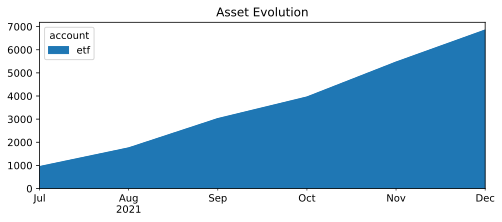
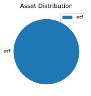

* Monthly investments evolution graph
 
* Summary balance sheet last three years
Balance Sheet 2019-12-31..2021-12-31, valued at period ends

             || 2019-12-31  2020-12-31  2021-12-31 
=============++====================================
 Assets      ||                                    
-------------++------------------------------------
 assets      ||          0           0    € 113.42 
-------------++------------------------------------
             ||          0           0    € 113.42 
=============++====================================
 Liabilities ||                                    
-------------++------------------------------------
-------------++------------------------------------
             ||                                    
=============++====================================
 Net:        ||          0           0    € 113.42 
* Balance sheet valued at period ends
Balance Sheet 2021-12-31, valued at period ends

                   || 2021-12-31 
===================++============
 Assets            ||            
-------------------++------------
 assets            ||   € 113.42 
   cash            || € -6731.46 
   investments:etf ||  € 6844.88 
===================++============
 Liabilities       ||            
-------------------++------------
* Investments converted to cost in €
Investments 2021, converted to cost in € 
        68.0000 VWCE  ...             € 6722.21  VWCE
                           --------------------
                                      € 6722.21  
