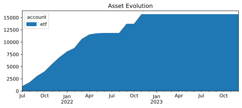
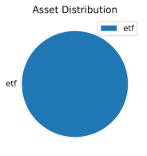

* Monthly investments evolution graph
 
* Summary balance sheet last three years
Balance Sheet 2021-12-31..2023-12-31, valued at period ends

             || 2021-12-31  2022-12-31  2023-12-31 
=============++====================================
 Assets      ||                                    
-------------++------------------------------------
 assets      ||   € 113.42   € -271.28   € -271.28 
-------------++------------------------------------
             ||   € 113.42   € -271.28   € -271.28 
=============++====================================
 Liabilities ||                                    
-------------++------------------------------------
-------------++------------------------------------
             ||                                    
=============++====================================
 Net:        ||   € 113.42   € -271.28   € -271.28 
* Balance sheet valued at period ends
Balance Sheet 2023-12-31, valued at period ends

                   ||  2023-12-31 
===================++=============
 Assets            ||             
-------------------++-------------
 assets            ||   € -271.28 
   cash            || € -15894.83 
   investments:etf ||  € 15623.55 
===================++=============
 Liabilities       ||             
-------------------++-------------
* Investments converted to cost in €
Investments 2023, converted to cost in € 
       163.0000 VWCE  ...            € 15871.80  VWCE
                           --------------------
                                     € 15871.80  
