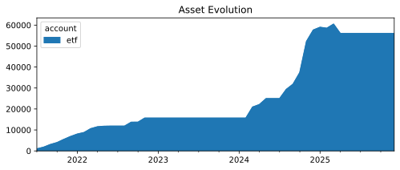
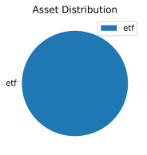

* Monthly investments evolution graph
 
* Summary balance sheet last three years
Balance Sheet 2023-12-31..2025-12-31, valued at period ends

             || 2023-12-31  2024-12-31  2025-12-31 
=============++====================================
 Assets      ||                                    
-------------++------------------------------------
 assets      ||  € -271.28   € 7239.11   € -111.19 
-------------++------------------------------------
             ||  € -271.28   € 7239.11   € -111.19 
=============++====================================
 Liabilities ||                                    
-------------++------------------------------------
-------------++------------------------------------
             ||                                    
=============++====================================
 Net:        ||  € -271.28   € 7239.11   € -111.19 
* Balance sheet valued at period ends
Balance Sheet 2025-12-31, valued at period ends

                   ||  2025-12-31 
===================++=============
 Assets            ||             
-------------------++-------------
 assets            ||   € -111.19 
   cash            || € -56079.27 
   investments:etf ||  € 55968.08 
===================++=============
 Liabilities       ||             
-------------------++-------------
* Investments converted to cost in €
Investments 2025, converted to cost in € 
       476.0000 VWCE  ...            € 56028.30  VWCE
                           --------------------
                                     € 56028.30  
