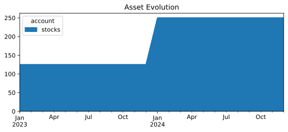
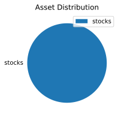

* Monthly investments evolution graph
 
* Summary balance sheet last three years
Balance Sheet 2022-12-31..2024-12-31, valued at period ends

             || 2022-12-31  2023-12-31  2024-12-31 
=============++====================================
 Assets      ||                                    
-------------++------------------------------------
-------------++------------------------------------
             ||                                    
=============++====================================
 Liabilities ||                                    
-------------++------------------------------------
-------------++------------------------------------
             ||                                    
=============++====================================
 Net:        ||                                    
* Balance sheet valued at period ends
Balance Sheet 2024-12-31, valued at period ends

                      || 2024-12-31 
======================++============
 Assets               ||            
----------------------++------------
 assets               ||          0 
   cash               ||   $-250.14 
   investments:stocks ||    $250.14 
======================++============
 Liabilities          ||            
----------------------++------------
* Investments converted to cost in $
Investments 2024, converted to cost in $ 
              2 aapl  ...               $250.14  ...
                           --------------------
                                        $250.14  
